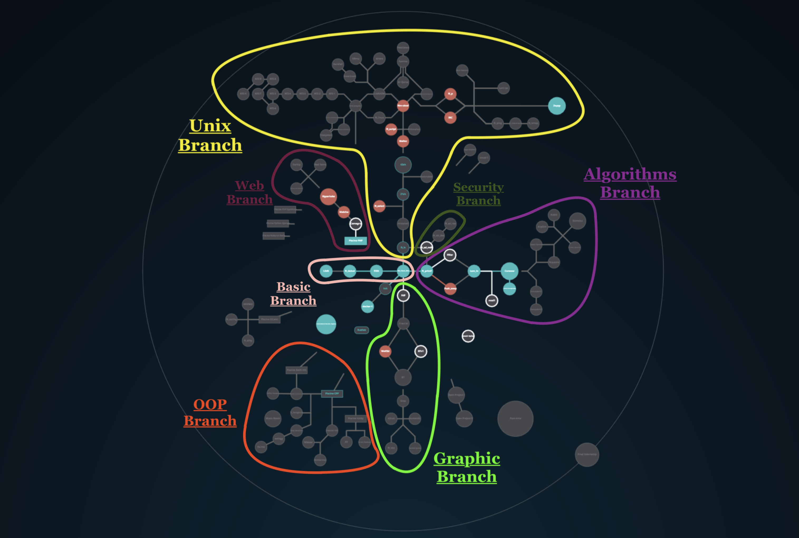
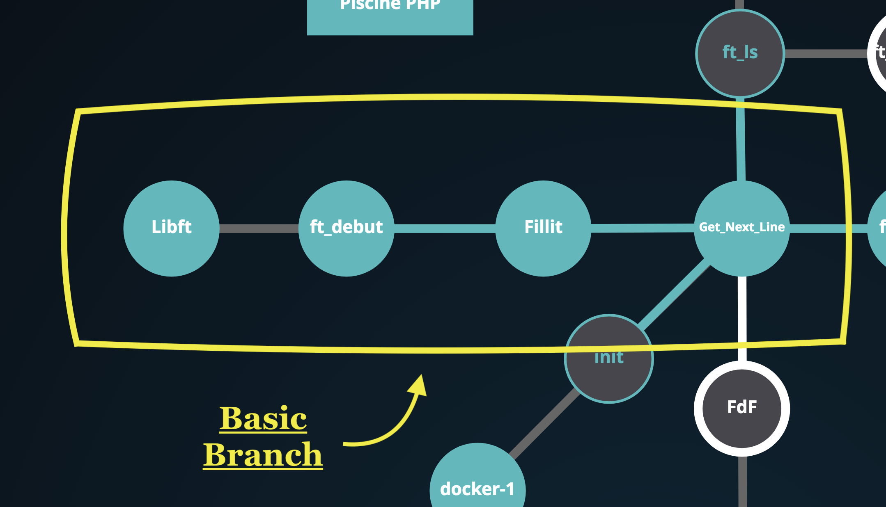
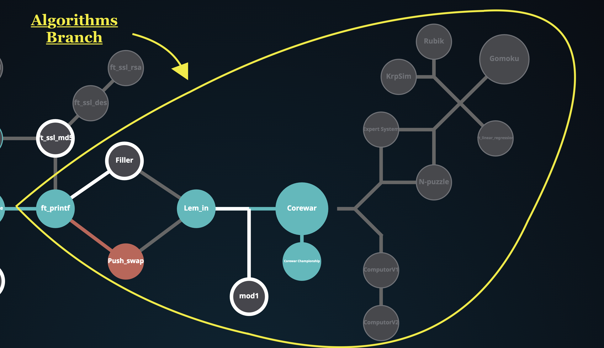
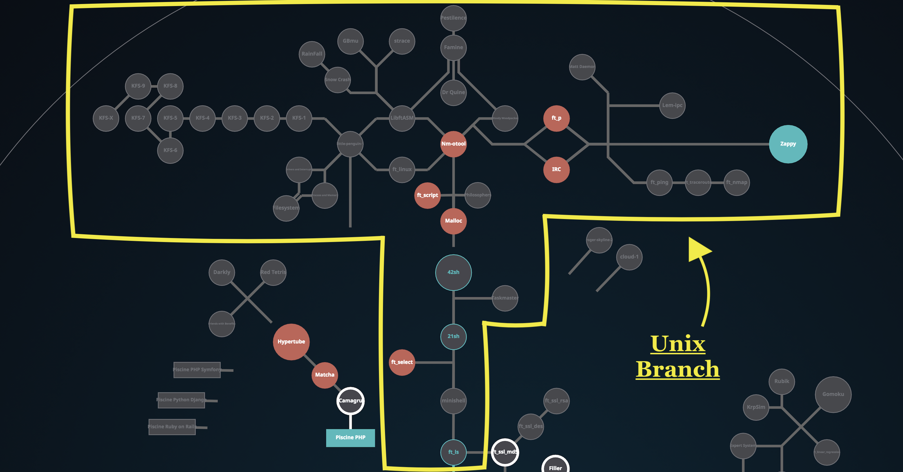

# 42 [my] Projects
  ### (Some of the repos are private so you may not be able to access them)
  
|Project|Branch|Curriculum|Difficulty|Language|Status|
|:-:|:-:|:-:|:-:|:-:|:-:|
|[Libft](https://github.com/psprawka/Libft)|Base|42|T1|C|:rooster:|
|[Fillit](https://github.com/psprawka/Fillit)|Base|42|T1|C|:rooster:|
|[GetNextLine](https://github.com/psprawka/GetNextLine)|Base|42|T1|C|:rooster:|
|[Ft_printf](https://github.com/psprawka/ft_printf)|Algorithms|42|T1|C|:rooster:|
|[Docker-1](https://github.com/psprawka/docker-1)|Dev-Ops|42 Starfleet|T1|Shell|:rooster:|
|[Ls](https://github.com/psprawka/ft_ls)|Unix|42 Starfleet|T1|C|:hatched_chick:|
|[PHP Piscine](https://github.com/psprawka/Php_piscine)|Web|42 Starfleet|T1|HTML/CSS/PHP|:rooster:| 
|[C++ Piscine](https://github.com/psprawka/Cpp_piscine)|OOP|42 Starfleet|T2|C++|:rooster:|
|[Matcha](https://github.com/psprawka/Matcha)|Web|42 Starfleet|T2|HTML/CSS/JS/PHP|:hatching_chick:|
|[Ft_ssl](https://github.com/psprawka/Ft_ssl)|Security|42 Starfleet|T2|C|:rooster:|
|[Lem_In](https://github.com/psprawka/Lem-in)|Algorithms|42 Starfleet|T2|C|:rooster:|
|[Malloc](https://github.com/psprawka/ft_malloc)|Unix|42 Starfleet|T2|C|:hatched_chick:|
|[Nm_otool](https://github.com/psprawka/nm-otool)|Unix|42 Starfleet|T2|C|:hatching_chick:|
|[IRC](https://github.com/psprawka/IRC)|Unix|42 Starfleet|T2|C|:hatched_chick:|
|[Abstract VM](https://github.com/psprawka/Abstract_VM)|OOP|42 Starfleet|T2|C++|:rooster:|
|[LibftASM](https://github.com/psprawka/libftASM)|Unix|42 Starfleet|T2|ASM|:rooster:|
|[Hypertube](https://github.com/psprawka/Hypertube)|Web|42 Starfleet|T3|JS|:hatching_chick:| 
|[Corewar](https://github.com/psprawka/corewar)|Algorithms|42 Starfleet|T3|C|:rooster:| 
|[Zappy](https://github.com/psprawka/Zappy)|Unix|42 Starfleet|T4|C/C++/Pyton|:rooster:|

   
# 42 Starfleet Academy - Curriculum
  ### Below there are three quarters (9 months) of 42 Starfleet Academy (projects and deadlines): 

  
   
  

   
# 42 Holly Graph
 ### There are a few branches in 42 Holly Graph (42 curriculum):

 

### 1. Basic branch - the beginning of 42 cursus.
 
 

### 2. Algorithms branch - the easiest road to take if you like to think logically.
  
 

### 3. Unix branch - the most difficult, but the most useful branch in 42 curriculum.
  
 
   
# Hackathons at 42
|Name|Language|
|:-:|:-:|
|[ESPC Hackathon](https://github.com/psprawka/Restoratio)|HTML/CSS/JS|
|[Hackathon II](https://github.com/psprawka/Moodweb)|HTML/CSS/JS|
